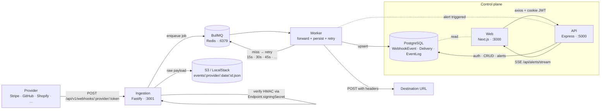
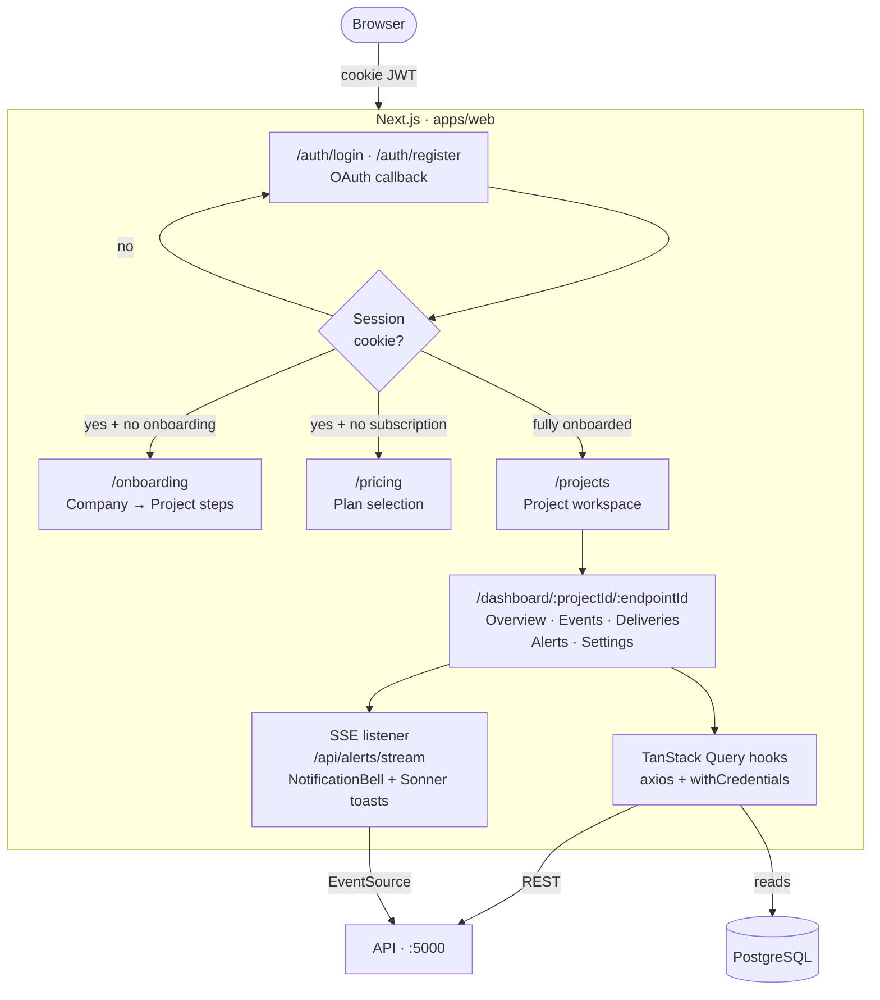
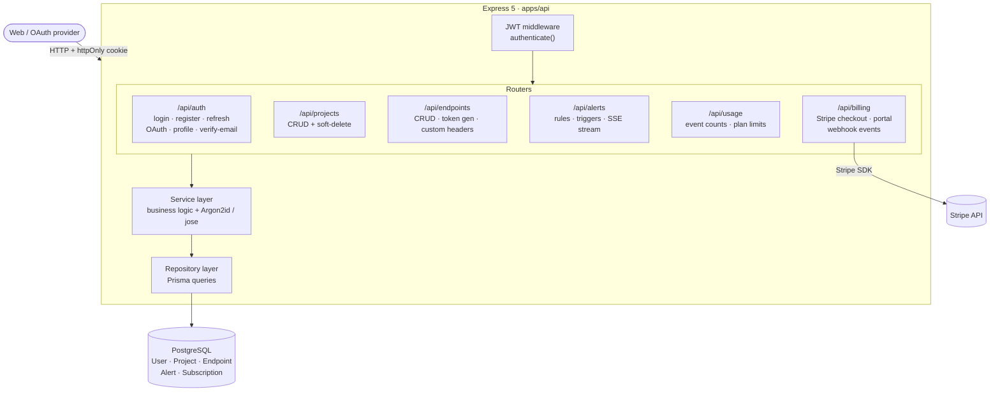
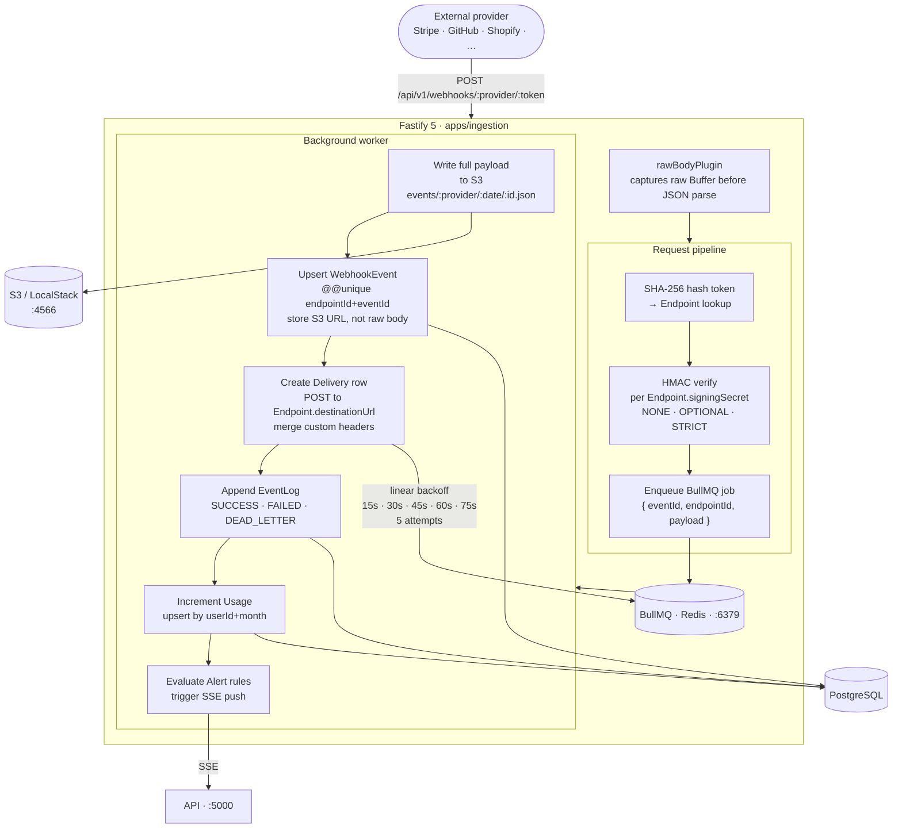

<div align="center">

# HookScope

**A multi-tenant webhook observability platform — ingest, verify, replay, and forward webhooks with full audit trails.**


</div>

---

## Overview

HookScope is a self-hostable webhook observability layer for teams that depend on third-party webhooks (Stripe, GitHub, Shopify, Slack, Twilio, …). Every webhook is **verified**, **archived to S3**, **persisted with a full audit trail**, **forwarded to your destination with retries**, and **surfaced on a live dashboard** with alerts and replay. It solves the problem of webhooks being a black box — dropped deliveries, unverified signatures, and no way to trace failures after the fact.

The platform is organised as a Turborepo with three deployable apps — a split ingestion path (Fastify) to keep webhook intake fast, an authenticated management API (Express), and a Next.js dashboard.

---

## Monorepo Structure

```
webhook-observability/
├── apps/
│   ├── api/             # Express 5 · Auth, projects, endpoints, alerts CRUD     (:5000)
│   ├── ingestion/       # Fastify 5 · High-throughput webhook intake + workers  (:3001)
│   └── web/             # Next.js 16 · Dashboard UI                             (:3000)
│
├── packages/
│   ├── db/              # Prisma schema, client, migrations   (@workspace/db)
│   ├── redis/           # Singleton ioredis client wrapper    (@workspace/redis)
│   ├── s3/              # S3Client wrapper (LocalStack-ready) (@workspace/s3)
│   ├── ui/              # Shared shadcn/ui components         (@workspace/ui)
│   ├── eslint-config/   # Shared ESLint presets
│   └── typescript-config/ # Shared tsconfig presets
│
├── infra/localstack/    # LocalStack bootstrap (creates webhooks bucket)
├── docker-compose.yml   # Postgres 17 · Redis 7 · LocalStack
└── turbo.json
```

---

## Tech Stack

| Layer          | `apps/api`                           | `apps/ingestion`                          | `apps/web`                                 |
| -------------- | ------------------------------------ | ----------------------------------------- | ------------------------------------------ |
| Runtime        | Bun                                  | Bun                                       | Bun / Node 20+                             |
| Framework      | Express 5                            | Fastify 5                                 | Next.js 16 (App Router, Turbopack)         |
| Language       | TypeScript 5.9                       | TypeScript 5.9                            | TypeScript 5.9                             |
| Primary role   | Auth · CRUD · Alerts                 | Webhook intake · Signature verify · Queue | Dashboard · SSE notifications              |
| Key libraries  | `jose`, `zod`, `cookie-parser`, `nodemailer`, `express-rate-limit` | `bullmq`, `stripe`, `@fastify/helmet`, `fastify-plugin`, `pino-pretty` | React 19, TanStack Query, React Hook Form + Zod, axios, next-themes, lucide-react |
| Auth           | JWT (jose, HS256) + opaque refresh tokens, Argon2id via `Bun.password` | —                                         | httpOnly cookie session                     |

**Shared infra:** PostgreSQL 17 · Redis 7 (BullMQ) · S3 (LocalStack in dev) · Prisma 7 · TanStack Query · shadcn/ui · Tailwind v4

---

## Getting Started

### Prerequisites

- [Bun](https://bun.sh) `>= 1.2.21`
- [Docker](https://www.docker.com) (for Postgres, Redis, LocalStack)
- Node.js `>= 20` (for tooling compatibility)

### Setup

```bash
# 1. Clone
git clone https://github.com/<your-org>/webhook-observability.git
cd webhook-observability

# 2. Install all workspace deps
bun install

# 3. Copy env templates (one .env per app — see Environment Variables below)
cp apps/api/.env.example apps/api/.env
cp apps/ingestion/.env.example apps/ingestion/.env
cp apps/web/.env.example apps/web/.env
cp packages/db/.env.example packages/db/.env

# 4. Start infrastructure (Postgres, Redis, LocalStack)
docker compose up -d

# 5. Generate Prisma client + run migrations
bun run db:generate
bun run db:migrate:dev

# 6. Boot all apps in parallel
bun run dev
```

Then open:

- Dashboard → <http://localhost:3000>
- Management API → <http://localhost:5000>
- Ingestion endpoint → <http://localhost:3001/api/v1/webhooks/stripe/:token>

### Running a single app

```bash
bun run dev --filter=api
bun run dev --filter=@workspace/ingestion
bun run dev --filter=web
```

---

## Environment Variables

Every app/package reads its own `.env` (there is no root `.env`). Templates live at
`apps/{api,ingestion,web}/.env.example` and `packages/db/.env.example` — they are
generated from the central schemas in `packages/env`. Validate any app against its
schema with `bun run check:env` (or `bun run dev` runs it automatically).

Required variables per app:

### `apps/api`

| Key                  | Required | Description                                                    |
| -------------------- | :------: | -------------------------------------------------------------- |
| `DATABASE_URL`       |    ✓     | Postgres connection string                                     |
| `REDIS_URL`          |    ✓     | Redis connection string                                        |
| `JWT_ACCESS_SECRET`  |    ✓     | Secret used to sign access tokens (e.g. `openssl rand -hex 32`)|
| `MAINTENANCE_SECRET` |    ✓     | Secret for maintenance endpoints                               |
| `API_BASE_URL`       |    ✓     | Public base URL of the API (OAuth callbacks)                   |
| `FRONTEND_URL`       |    ✓     | Public URL of the web dashboard (CORS + redirects)             |
| `INGESTION_BASE_URL` |    ✓     | Base URL of the ingestion server                               |

### `apps/ingestion`

| Key                     | Required | Description                                  |
| ----------------------- | :------: | -------------------------------------------- |
| `DATABASE_URL`          |    ✓     | Postgres connection string                   |
| `REDIS_URL`             |    ✓     | Redis connection string (queues + cache)     |
| `S3_ENDPOINT`           |    ✓     | S3-compatible endpoint (MinIO/LocalStack)    |
| `S3_BUCKET`             |    ✓     | Bucket for stored webhook payloads           |
| `AWS_REGION`            |    ✓     | AWS region                                   |
| `AWS_ACCESS_KEY_ID`     |    ✓     | S3 access key                                |
| `AWS_SECRET_ACCESS_KEY` |    ✓     | S3 secret key                                |

### `apps/web`

| Key                  | Required | Description                                       |
| -------------------- | :------: | ------------------------------------------------- |
| `NEXT_PUBLIC_API_URL`|    ✓     | Public URL of the API server (`http://localhost:5000`) |

### `packages/db`

| Key           | Required | Description                  |
| ------------- | :------: | ---------------------------- |
| `DATABASE_URL`|    ✓     | Postgres connection string   |

To add, rename, or remove a variable, edit `packages/env/src/docs.ts` + `packages/env/src/schemas.ts` and run `bun run check:env generate` to regenerate the templates.

---

## Available Scripts

Run from the repo root — Turbo fans these out across the workspace.

| Command                    | What it does                                               |
| -------------------------- | ---------------------------------------------------------- |
| `bun run dev`              | Starts **api**, **ingestion**, and **web** in parallel     |
| `bun run build`            | Type-checks and builds every app and package               |
| `bun run lint`             | ESLint across the monorepo                                 |
| `bun run typecheck`        | `tsc --noEmit` in every workspace                          |
| `bun run format`           | Prettier write                                             |
| `bun run db:generate`      | Regenerate Prisma client                                   |
| `bun run db:migrate:dev`   | Create + apply a dev migration                             |
| `bun run db:migrate:deploy`| Apply pending migrations (CI / prod)                       |
| `bun run db:push`          | Push schema without a migration (prototyping only)         |
| `bun run db:studio`        | Open Prisma Studio                                         |

Scope a command to a single app with `--filter`:

```bash
bun run build --filter=web
bun run typecheck --filter=api
```

---

## Architecture

The ingestion path is kept deliberately separate from the management API so that auth and CRUD traffic can never slow down webhook intake.



---

### Frontend — `apps/web` (Next.js · :3000)



---

### Management API — `apps/api` (Express 5 · :5000)



---

### Ingestion Layer — `apps/ingestion` (Fastify 5 · :3001)



---

**Key flow details**

1. `rawBodyPlugin` captures the raw `Buffer` before Fastify parses JSON — required for HMAC verification.
2. The token in the URL is hashed with SHA-256 and used to look up the `Endpoint`. Signing secrets live **on the endpoint**, not in global env vars — so every tenant has its own secret surface.
3. The full payload is written to S3 (`events/:provider/:date/:eventId.json`) and only the URL is stored in Postgres. Deduplication is enforced by `@@unique([endpointId, eventId])`.
4. A BullMQ worker handles delivery with **linear backoff** (`attemptsMade × 15s`, 5 attempts), writes a `Delivery` row per attempt, and appends to `EventLog` — failure is persisted *before* the job is rethrown so retries never lose their audit trail.
5. Alert rules run against event/delivery state; triggers push live updates to the dashboard over SSE (`NotificationBell`).

---

## Deployment

<!-- TODO (user contribution): replace this section with your real deployment setup. -->

HookScope is designed to be self-hosted. Each deployable is independent:

- **`apps/web`** — deploy as a standard Next.js app (Vercel, Fly.io, self-hosted Node).
- **`apps/api`** — long-running Bun / Node process behind a reverse proxy. Needs access to Postgres.
- **`apps/ingestion`** — long-running Bun / Node process with a public HTTPS endpoint. Needs access to Postgres, Redis, and an S3 bucket. A `Dockerfile` is provided.
- **Infra** — managed Postgres 17, managed Redis 7, and real S3 (swap out LocalStack).

> _Document your actual deployment targets and CI here once they're chosen._

---

## Roadmap

<!-- TODO (user contribution): replace this checklist with your real priorities. -->

**Shipped**

- [x] Multi-tenant endpoint model with per-endpoint signing secrets
- [x] Stripe ingestion with HMAC verification + BullMQ linear-backoff retries
- [x] S3 payload archival + Postgres audit trail (`WebhookEvent` / `Delivery` / `EventLog`)
- [x] JWT + refresh-token auth with theft detection (token-family revocation)
- [x] OAuth sign-in (Google, GitHub) with auto-link strategy
- [x] Dashboard: projects, endpoints, events, deliveries, alerts, live feed
- [x] Alert rules + SSE-driven notification bell

**Next**

- [ ] _Add the next items you want to build_
- [ ] _…_

---

## License

Released under the [MIT License](LICENSE).

<div align="center">
<sub>Built with Bun · Turborepo · Prisma · Fastify · Express · Next.js</sub>
</div>
